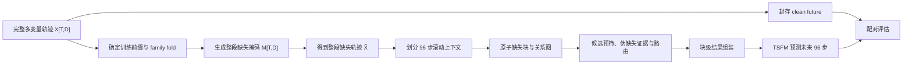

# TSFM-FAIS：面向下游 TSFM 预测的块级多算法缺失值填补

TSFM-FAIS 实现 B-FAIS（Block-wise Forecast-Aware Imputer Selection）。系统接收带缺失的多变量时间序列，将每个变量上的极大连续缺失区间表示为原子块，从可扩展候选池中为不同缺失块选择填补算法，再组装成完整上下文供下游时间序列基础模型（TSFM）预测。填补阶段始终使用全部变量；预测阶段既支持原生联合多变量模型，也支持将一个或多个目标变量分别交给单变量模型。

截至 2026-07-18，`sequence-mask-96x96-v2` 主实验已在 TimesFM 2.5 和 Chronos-2 上完成。按照“每个数据版本 30 个 episode、只比较 30/30 原生有效候选、均值严格更低且平局计负”的预注册口径，B-FAIS 在两个下游模型上均取得 **16/30** 个数据版本严格胜出；排除用于方法开发的 4 个 ETT 版本后，两者均为 **12/26**。该结论表示逐数据版本胜出数量达到项目目标，不表示所有数据版本或跨数据集宏平均指标均优于最佳单候选。

## 问题定义

给定完整多变量轨迹 \(X\in\mathbb{R}^{T\times D}\)、观测掩码 \(M\in\{0,1\}^{T\times D}\)、目标预测器 \(f\) 和计算预算，B-FAIS 为缺失块集合 \(\mathcal B\) 求解候选分配 \(a_b\)：

```text
E(a) = Σ_b R(b, a_b)
     + β Σ_(b,c)∈Edges φ(b, c, a_b, a_c)
```

`R` 表示单块下游预测风险，`φ` 表示相关缺失块采用不同候选时的交互风险。路由目标由冻结 TSFM 在反事实填补上下文上的预测损失产生；填补重构误差、历史伪缺失证据、块结构和候选成本共同作为特征。运行时间约束位于候选预筛阶段，因为短名单中的候选必须先完成推理才能进入路由；在组装阶段惩罚“启用候选数”不会减少已经发生的计算。

## 新版主实验协议

### 固定设置

| 项目 | 设置 |
|---|---|
| 协议 ID | `sequence-mask-96x96-v2` |
| 上下文长度 | 96 |
| 预测长度 | 96 |
| 主评估滚动步长 | 96 |
| 填补输入 | `[96,D]` 多变量窗口 |
| 预测目标 | 第 0、1 个变量，按目标宏平均 |
| 目标缺失率 | `{0.1,0.2,0.3,0.4,0.5}` |
| 教师种子 | `20260710` |
| 最终评估种子 | `{22,33,44}`，在实验格中均衡轮换 |
| 每数据版本教师 episode 上限 | 30，覆盖全部 `6×5` 机制—缺失率组合 |
| 每数据版本评估 episode 上限 | 30，覆盖全部 `6×5` 组合 |
| 每数据版本 item 上限 | 4，确定性选择 |
| 候选短名单 | 最多 6 个，强制保留 LOCF 和线性插值 |
| Beam width | 32 |
| TSFM 预测样本数 | 20 |

上下文长度和预测长度在填补器训练、教师标签、路由器训练和最终预测中统一为 96。工程 smoke 可以使用更短的合成序列以控制执行时间；它不产生论文实验结果。

### 整段序列先生成缺失，再划分滚动窗口

每个 `(dataset, item, mechanism, rate, seed)` 只生成一次完整轨迹掩码：

\[
M_s=G(X,m,r,s),\qquad
\widetilde X_s=M_s\odot X+(1-M_s)\odot\mathrm{NaN}.
\]

随后从同一个 \(\widetilde X_s\) 提取滚动预测 episode：

\[
C_{s,t}=\widetilde X_s[t-96:t],\qquad
Y_t=X[t:t+96,\{0,1\}].
\]

掩码种子只包含数据集、item、机制、缺失率和重复种子，不包含预测起点。不同滚动窗口在相同时间位置共享同一缺失状态。Clean future 只用于教师损失和最终评分，不进入填补器、路由特征或 TSFM 输入。



主实验不按窗口实际缺失数量筛选 episode。结果同时报告全部窗口和实际包含缺失的窗口，避免由难度筛选造成偏差。每个产物保存整段目标缺失率、整段实际缺失率、窗口局部缺失率和缺失实现 ID。

### 六种序列级缺失机制

| ID | 定义 |
|---|---|
| `random_point` | 在完整轨迹上产生随机点缺失 |
| `independent_block` | 各变量独立产生连续缺失块 |
| `synchronous_block` | 同一时间区间内全部变量同步缺失 |
| `staggered_correlated` | 根据训练前缀的相关变量组产生带偏移的相关块 |
| `value_dependent` | 使用训练前缀的中位数和 MAD 标准化，偏离中心的值具有更高缺失概率 |
| `mixed_outage` | 随机点与连续故障块构成的序列级混合缺失过程 |

连续块长度从 `{6,12,24,48}` 中确定性抽样。主实验不强制在每个预测起点前生成尾部缺失；预测前突发故障可作为独立压力测试，其结果不并入主表。

### 数据准入和外层划分

[`configs/data/datasets.yaml`](configs/data/datasets.yaml) 登记 32 个来源完整、无 NaN/Inf、至少包含两个变量的数据版本。数据仍保存在相邻 `TSFM-SPImpute/data/Origin` 目录，无需移动或复制。每次实验必须重新执行审计；旧审计文件不复用。

最终预测要求训练前缀、96 步上下文和 96 步未来均可用。32 个已审计版本中有 30 个产生了完整评估 episode，覆盖 17 个 family：

| 格式 | 进入 96→96 预测实验的数据版本 |
|---|---|
| CSV | `electricity`, `ETTh1`, `ETTh2`, `ETTm1`, `ETTm2`, `exchange_rate`, `national_illness`, `traffic` |
| Arrow | `azure2019_D_5T`, `azure2019_I_5T`, `azure2019_U_5T`, `Coastal_T_S_15T`, `Coastal_T_S_20T`, `Coastal_T_S_H`, `current_velocity_5T`, `current_velocity_15T`, `current_velocity_20T`, `current_velocity_H`, `EWELD_Load_15T`, `JOLTS_M`, `NE_China_Wind_H`, `OpenElectricity_NEM_5T`, `Port_Activity_D`, `Port_Activity_W`, `Supply_Chain_Customer_D`, `Supply_Chain_Location_D`, `Uncertainty_1M_M`, `US_Labor_M`, `Vehicle_Sales_M`, `Vehicle_Supply_M` |

`Housing_Inventory_M` 只有 114 步；`Job_Claims_W` 虽有 196 步，但在训练前缀和滚动起点分区后没有合格的评估 episode。两者均保留在 32 版本完整性审计中，不进入 30 数据版本结果。

实验使用时间顺序的 `rolling_origin` 划分。教师标签来自训练起点，最终指标来自更晚的评估起点；评估 future、评估候选损失和主实验汇总均不进入填补器或路由器训练。ETT 四个版本仅用于选择推理期组合规则和权重，剩余 26 个版本作为确认集。主路由器可以使用同一数据版本较早训练起点的教师标签，因此这里检验的是时间外推与新 episode 泛化，不是未见数据族泛化。学习型填补器只允许读取预测起点之前的历史做拟合或标准化。

## 候选填补池

默认注册 20 个标准候选，不包含任何 SPImpute 方法。当前 TRMF 适配器因 PyPOTS 1.5 生命周期与冻结 artifact 协议不兼容而禁用；正式运行前冻结可执行清单，运行中不增删候选。

| 类别 | 候选 ID |
|---|---|
| 逐变量经典方法 | `locf`, `linear_interp`, `seasonal_lag`, `kalman_local_trend`, `kalman_ar`, `stl_kalman`, `gp_rbf` |
| 联合结构化方法 | `knn_multivariate`, `mice`, `missforest`, `softimpute` |
| 深度/时序方法 | `trmf`, `brits`, `gpvae`, `saits`, `csdi`, `imputeformer`, `helix`, `timemixerpp`, `totem` |

所有候选实现统一的训练与推理契约：

```python
fit(train_batch, metadata) -> artifact
impute(batch, artifact, seed) -> CandidateResult
```

逐变量方法遍历全部 `D` 个变量后重新组装 `[N,L,D]`；联合方法直接处理完整多变量张量。公共 runner 恢复原观测值并显式记录原生有效掩码、失败原因、耗时和内存。新增算法只需实现适配器并注册 `ImputerSpec`，路由代码不依赖具体候选类。

## 块级路由

每个变量上的极大连续缺失区间构成一个 `MissingBlock`。块关系图包含同变量相邻边、跨变量时间重叠边和训练期高相关变量边。特征覆盖块长度、相对位置、边界可用性、局部与整段缺失率、周期、相关性、候选能力、候选成本、TSFM 能力和伪缺失重构证据。

`R0` 和 `R1` 使用 LightGBM LambdaMART，候选是行、同一块的候选构成 ranking group；块对交互使用 LightGBM Huber 回归。预筛强制保留 `locf`、`linear_interp`，再按预测风险覆盖和教师阶段观测到的候选运行时间加入候选，总数不超过 6。伪缺失块优先匹配真实块的变量、长度和相对位置，重构证据按变量计算。独立单变量 TSFM 的教师标签只采样其实际读取的目标变量；推理时模型不可见的辅助变量块使用线性插值或 LOCF 的快速安全选择。最终分配采用确定性 beam search；小规模穷举只用于正确性测试。

当前主路由器由 Chronos-2 与 TimesFM 2.5 的训练期教师标签联合训练，并使用 TSFM 模型 one-hot 特征形成模型条件风险。推理时两个 TSFM 分别执行路由。Chronos-Bolt、Sundial 和 TiREx 已登记适配接口，但本轮没有生成其教师标签或主实验结果。

### 冻结的模型专属组装规则

TimesFM 2.5 使用目标变量级 forecast medoid、伪缺失风险相对优势至少 `0.05` 时权重 `0.50` 的候选融合，以及对原生有效块向 `seasonal_lag` 收缩 `0.10`。Chronos-2 使用预测一致性最好的两个候选均值；对 `seasonal_lag` 原生有效的块收缩 `0.90`，只在其无原生值时对 `linear_interp` 收缩 `0.75`，两者都无效时保留结构化路由结果。后一规则在 ETT 上按“胜出数、最差差值、平均差值”的顺序冻结，正式 ETT 结果为 4/4，最差差值为 `-0.045974`。

这些操作始终以缺失块为单位，并检查候选的原生有效掩码。不同块可以使用不同候选或候选组合；回退生成的安全值不会被标记为候选成功。最终 Chronos-2 条件 fallback 覆盖 40,764 个块，额外运行时间相对前一固定收缩版本增加约 7.46 秒（900 episode 上约 0.27%）。

## 填补选择对比基线

仓库提供 `MetaOD + DSelect-1 + NeuralUCB + ALORS + HybridLSTM + Random-Valid-Block` 六个块级选择基线。实现将论文中的核心选择机制映射到本仓库统一的“块—候选逐行评分”接口；任务特征、监督信号和候选集合均按 TSFM-FAIS 协议重新定义，因此这些实现属于面向本任务的可复现实验适配，不表示逐行复刻作者代码或复现原论文数值。

| 配置 ID | 方法来源 | 仓库实现 |
|---|---|---|
| `metaod` | [MetaOD，NeurIPS 2021](https://proceedings.neurips.cc/paper_files/paper/2021/hash/23c894276a2c5a16470e6a31f4618d73-Abstract.html) | 原文以 smooth-DCG 优化潜在性能；本任务适配改用成对 logistic 排序损失分解稀疏的块—候选效用，再以随机森林把新块的上下文特征映射到潜在空间。 |
| `dselect1` | [DSelect-k，NeurIPS 2021](https://proceedings.neurips.cc/paper_files/paper/2021/hash/f5ac21cd0ef1b88e9848571aeb53551a-Abstract.html) | 取 `k=1`，使用二进制编码和 smooth-step 构造可微稀疏门，在每个训练组的可用候选上最小化掩码化期望损失，并按论文补充材料惩罚非 2 次幂候选产生的空码概率。 |
| `neuralucb` | [NeuralUCB，ICML 2020](https://proceedings.mlr.press/v119/zhou20a.html) | MLP 估计上下文—候选回报，参数梯度的对角精度近似产生 UCB；按训练组顺序离线回放，每组只揭示被选候选的反馈。 |
| `alors` | [ALORS，Artificial Intelligence 2017](https://www.sciencedirect.com/science/article/pii/S0004370216301436) | 原文使用 CoFiRank/NDCG 学习排序；本任务适配对稀疏块—候选效用矩阵执行掩码 ALS，以随机森林完成新块潜在因子的冷启动预测。 |
| `hybrid_lstm` | [HybridLSTM，Applied Soft Computing 2025](https://www.sciencedirect.com/science/article/pii/S1568494625001565) | 将块静态分支与按 `start_ratio → channel_ratio → block_id` 排序的 LSTM 分支拼接，联合优化最优候选多分类损失和近最优候选多标签损失。 |
| `random_valid_block` | 随机对照 | 根据训练种子、运行种子、块 ID 和候选 ID 生成稳定的 SHA-256 均匀分数；路由器先排除原生无效候选，再选择随机分数最高者。 |

五个学习型基线统一使用 `prior_features` 和 `forecast_loss` 教师目标；随机对照不读取教师损失。基线运行关闭伪缺失候选、块对交互、预测共识、证据混合、显式候选成本惩罚和切换惩罚，其中 `prior_features` 内的 `candidate_cost` 特征仍保留供学习型方法使用。短名单上限设为 19，使 Random-Valid-Block 在完整原生有效候选集合内随机选择。候选失败、尾部能力、原生有效掩码和安全回退仍由公共推理流程处理。训练产物保存在 `routers/<method>/router_bundle.joblib`，填补 NPZ、分配 JSON 和评估行分别记录动态方法 ID；旧 B-FAIS 产物继续默认使用 `b_fais`。

神经选择器训练需要独立的 PyTorch extra。主实验与 ETT 复现入口分别为 `configs/main_rolling_{train,eval}_baselines.yaml` 和 `configs/ett_rolling_{train,eval}_baselines.yaml`：

```powershell
pip install -e ".[dev,selector-baselines]"
python -m tsfm_fais config validate --config configs/main_rolling_train_baselines.yaml
python -m tsfm_fais run --config configs/main_rolling_train_baselines.yaml --stage train-router --run-id router-baselines --labels-artifact artifacts/labels-merged/teacher_labels.jsonl --execute
```

训练命令一次生成六个路由器。推理和评估时按方法选择对应子目录；如已有完整候选源，可通过 `--candidate-source-impute-artifact` 复用经过身份校验的候选张量：

```powershell
$method = "metaod"
python -m tsfm_fais run --config configs/main_rolling_eval_baselines.yaml --stage impute --run-id "impute-$method" --audit-artifact artifacts/data-audit.json --imputer-artifacts artifacts/fit/imputer_artifacts --router-artifact "artifacts/router-baselines/routers/$method" --candidate-source-impute-artifact artifacts/impute-candidate-source --forecaster-id chronos2 --execute
python -m tsfm_fais evaluate --config configs/main_rolling_eval_baselines.yaml --impute-artifact "artifacts/impute-$method" --forecaster-id chronos2 --forecaster-artifact <local-checkpoint> --output-dir "artifacts/eval-$method"
```

正式对比应让 B-FAIS 与六个基线复用同一候选源、冻结预测器和评估配置。完成评估后，可将各评估目录一次传给正式汇总器。汇总器会校验并去重一致的 clean、单候选和 oracle 公共行，将六个 `selector_baseline` 与 B-FAIS 纳入相同 episode 上的成对比较；公共行指标或元数据冲突时会拒绝合并：

```powershell
python -m tsfm_fais summarize-main --input artifacts/eval-b-fais artifacts/eval-metaod artifacts/eval-dselect1 artifacts/eval-neuralucb artifacts/eval-alors artifacts/eval-hybrid_lstm artifacts/eval-random_valid_block --output-dir artifacts/selector-comparison
```

2026-07-20 的实现验收使用仓库已有 ETT 全候选标签完成了 7,300 行、410 个块组、19 个候选的六模型训练和 joblib 重载，对应使用 ETT 专用配置的 `artifacts/dev-ett-selector-baselines-repro-v3/`。六个模型随后在同一真实 ETT episode 的 100 个缺失块上分别完成 100 个合法分配，组装值均有限且全部观测位置保持不变。另一个 `artifacts/dev-ett-metaod-impute-repro-v1/` 使用早先的 v2 MetaOD 路由器完成了四个 ETT 数据版本共 120 个 episode 的 CLI 填补；v2 同样由该 ETT 标签文件训练，但其 resolved config 记录的是主数据配置，因此该产物仅用于功能与续跑修复验收，不表示来自 v3 的完整产物来源。续跑校验识别并修复了 7 个旧方法标识记录，最终产物为 120/120 且方法 ID 一致。这里报告的是功能复现与工程验收，尚未报告六个基线相对 B-FAIS 的正式性能结论。

## TSFM 预测模式

| ID | 模式 | 输入与输出 |
|---|---|---|
| `chronos2` | `joint_multivariate` | 输入 `[N,96,D]`，输出目标预测 `[N,96,K]` |
| `timesfm2p5` | `independent_univariate` | 展开目标列为 `[N×K,96]` 后重组 |
| `chronosbolt` | `independent_univariate` | 同上 |
| `sundial` | `independent_univariate` | 同上 |
| `tirex` | `independent_univariate` | 同上 |

所有 TSFM 使用本地冻结 checkpoint，不进行微调。统一结果包含点预测 `[N,H,K]`、分位数 `[N,H,K,Q]` 和样本 `[N,S,H,K]`。独立单变量预测器只读取目标列；目标列在此前已通过全部变量联合填补。

## 评价与统计

主要指标为两个目标列宏平均 MASE。缩放项只从训练前缀计算并冻结到 schema 3 填补产物；历史足够时采用数据 manifest 的季节周期，其余情况使用 lag-1。Clean context 和 episode 级 oracle 仅用于诊断，不属于严格基线池。

严格数据版本胜出的计算口径为：每个数据版本必须有 30 个唯一 episode；B-FAIS 的 30 行必须全部有效；单候选只在 30/30 行均为 `native_valid=True`、`metric_eligible=True` 且 MASE 有限时进入比较池；比较池包含 `missing_anchor` LOCF 和所有完整可用的标准候选；先对每个方法的 30 个 episode 求均值，再选最低的单候选均值；`B-FAIS mean MASE - best candidate mean MASE < 0` 才计胜，平局计负。该规则防止候选通过失败或缺行获得不公平优势，也防止把安全回退值当作候选原生输出。

### 主实验结果

| 下游模型 | 预测模式 | 严格胜出 | 非 ETT 确认集 | 数据版本宏平均差值 | 最差数据版本差值 | 900 episode 填补耗时 | 修复数 |
|---|---|---:|---:|---:|---:|---:|---:|
| TimesFM 2.5 | 独立单变量 | **16/30** | **12/26** | -0.125476 | +1.151987 | 2776.73 s | 0 |
| Chronos-2 | 联合多变量 | **16/30** | **12/26** | +1.452083 | +33.503939 | 2766.14 s | 0 |

差值均为 `B-FAIS - 最佳完整原生单候选`，负值表示 B-FAIS 更好。Chronos-2 虽在 16 个数据版本严格胜出，其宏平均差值仍为正，主要受 Azure 数据版本的大幅失利影响；因此当前结果支持“达到至少 15 个数据版本胜出”的项目目标，不支持“跨数据集平均性能全面最优”的结论。

| 数据版本 | TimesFM 2.5：结果、差值、最佳单候选 | Chronos-2：结果、差值、最佳单候选 |
|---|---|---|
| `Coastal_T_S_15T` | 胜 -0.283016，`helix` | 胜 -0.071893，`timemixerpp` |
| `Coastal_T_S_20T` | 胜 -4.100862，`helix` | 负 +2.847988，`mice` |
| `Coastal_T_S_H` | 胜 -0.101903，`helix` | 胜 -0.083485，`helix` |
| `ETTh1` | 胜 -0.074226，`saits` | 胜 -0.096946，`saits` |
| `ETTh2` | 胜 -0.070649，`helix` | 胜 -0.061861，`helix` |
| `ETTm1` | 胜 -0.013295，`gpvae` | 胜 -0.074293，`mice` |
| `ETTm2` | 胜 -0.123414，`helix` | 胜 -0.079770，`helix` |
| `EWELD_Load_15T` | 胜 -0.011519，`mice` | 胜 -0.000973，`saits` |
| `JOLTS_M` | 负 +0.194023，`mice` | 负 +0.682478，`mice` |
| `NE_China_Wind_H` | 负 +0.186528，`softimpute` | 负 +0.222564，`softimpute` |
| `OpenElectricity_NEM_5T` | 负 +0.212293，`saits` | 胜 -0.044517，`knn_multivariate` |
| `Port_Activity_D` | 胜 -0.124788，`saits` | 胜 -0.123730，`saits` |
| `Port_Activity_W` | 胜 -0.000948，`locf` | 负 +0.036626，`kalman_ar` |
| `Supply_Chain_Customer_D` | 负 +0.436508，`mice` | 负 +0.287854，`mice` |
| `Supply_Chain_Location_D` | 负 +0.056435，`mice` | 胜 -0.020044，`mice` |
| `US_Labor_M` | 胜 -1.570501，`mice` | 胜 -0.637315，`mice` |
| `Uncertainty_1M_M` | 负 +0.158988，`knn_multivariate` | 负 +0.217503，`timemixerpp` |
| `Vehicle_Sales_M` | 胜 -0.121583，`missforest` | 胜 -0.235292，`mice` |
| `Vehicle_Supply_M` | 负 +0.182453，`csdi` | 胜 -0.359144，`mice` |
| `azure2019_D_5T` | 负 +0.052036，`saits` | 负 +7.061419，`softimpute` |
| `azure2019_I_5T` | 胜 -0.009594，`kalman_ar` | 负 +0.430608，`saits` |
| `azure2019_U_5T` | 胜 -0.060472，`saits` | 负 +33.503939，`softimpute` |
| `current_velocity_15T` | 负 +0.009354，`helix` | 负 +0.055101，`helix` |
| `current_velocity_20T` | 负 +0.000731，`missforest` | 负 +0.095474，`missforest` |
| `current_velocity_5T` | 负 +0.034779，`saits` | 胜 -0.047339，`saits` |
| `current_velocity_H` | 胜 -0.005273，`knn_multivariate` | 负 +0.097338，`softimpute` |
| `electricity` | 胜 -0.003495，`imputeformer` | 胜 -0.031021，`imputeformer` |
| `exchange_rate` | 负 +1.151987，`helix` | 胜 -0.205707，`helix` |
| `national_illness` | 负 +0.057139，`mice` | 负 +0.040926，`mice` |
| `traffic` | 负 +0.178014，`mice` | 负 +0.156017，`missforest` |

最终可核验产物为：

- TimesFM 2.5：[严格汇总](artifacts/main-seq96-opt99-eval-timesfm2p5-margin005-seasonal010-b128-v84/strict_aggregate.json)、[逐数据版本结果](artifacts/main-seq96-opt99-eval-timesfm2p5-margin005-seasonal010-b128-v84/strict_dataset_summary.csv)、[完整指标](artifacts/main-seq96-opt99-eval-timesfm2p5-margin005-seasonal010-b128-v84/episode_metrics.csv)。
- Chronos-2：[严格汇总](artifacts/main-seq96-opt115-eval-chronos2-seasonal090-linear075-b128-v100/strict_aggregate.json)、[逐数据版本结果](artifacts/main-seq96-opt115-eval-chronos2-seasonal090-linear075-b128-v100/strict_dataset_summary.csv)、[完整指标](artifacts/main-seq96-opt115-eval-chronos2-seasonal090-linear075-b128-v100/episode_metrics.csv)。
- Chronos-2 ETT 冻结验证：[严格汇总](artifacts/dev-ett-seq96-opt114-eval-chronos2-seasonal090-linear075-b128-v99/strict_aggregate.json)。

`artifacts/` 被 `.gitignore` 排除，上述链接面向完成本地实验的工作区。仓库不会提交数据、checkpoint 或大体积预测结果。2026-07-19 已清理 pilot、失败运行和被否决的调参产物，并保留能够解释或复用最终结果的主实验集合；2026-07-20 另行生成了本节记录的基线验收产物。

## 配置与阶段

当前保留 38 个 YAML 配置。它们分为数据/模型注册表、正式训练与评估配置、最终产物的上游复现配置，以及仍被配置 schema 回归测试读取的最小变体。主要入口如下：

| 配置 | 用途 |
|---|---|
| `configs/main.yaml` | 冻结填补器拟合配置，也是现有填补器 artifact 的来源配置 |
| `configs/main_rolling_train.yaml` | 训练起点教师标签与模型条件路由器，96×96 |
| `configs/main_rolling_eval.yaml` | 主实验候选源的基础滚动评估配置 |
| `configs/main_rolling_train_baselines.yaml` | 六个对比选择器的主数据训练配置 |
| `configs/main_rolling_eval_baselines.yaml` | 六个对比选择器的主数据填补与评估配置 |
| `configs/main_rolling_eval_consensus_times_targetwise_proxy050_margin005_seasonal010.yaml` | TimesFM 2.5 冻结主评估配置 |
| `configs/main_rolling_eval_consensus_chronos_top2_seasonal090_linear075.yaml` | Chronos-2 冻结主评估配置 |
| `configs/ett_rolling_train_full_candidates.yaml` | ETT 全候选教师标签复现配置 |
| `configs/ett_rolling_train_baselines.yaml` | ETT 全候选标签上的六基线训练配置 |
| `configs/ett_rolling_eval_baselines.yaml` | ETT 六基线填补与评估配置 |
| `configs/ett_rolling_eval_consensus_chronos_top2_seasonal090_linear075.yaml` | Chronos-2 ETT 冻结验证配置 |
| `configs/pilot.yaml` | 单数据版本、低预算的真实数据预检查 |
| `configs/smoke.yaml` | 无网络、无真实 checkpoint 的合成工程验证 |

`configs/router/` 中的最终路由配置与上述入口一一对应。少量 `prior_safe`、`top2_mean`、`pseudo_convex` 等文件只用于覆盖可选路由字段的回归测试，不代表新的正式实验结果。其余 76 个一次性调参 YAML 已删除。

CLI 将训练数据生成、模型拟合和推理解耦，主要入口为：

```powershell
python -m tsfm_fais config validate --config configs/main_rolling_train.yaml
python -m tsfm_fais data audit --manifest configs/data/datasets.yaml --output artifacts/data-audit.json
python -m tsfm_fais run --config configs/main_rolling_train.yaml --stage fit-imputers --run-id fit --audit-artifact artifacts/data-audit.json --execute
python -m tsfm_fais run --config configs/main_rolling_train.yaml --stage labels --run-id labels-<model> --audit-artifact artifacts/data-audit.json --imputer-artifacts artifacts/fit/imputer_artifacts --forecaster-id <model> --forecaster-artifact <local-checkpoint> --execute
python -m tsfm_fais labels merge --inputs artifacts/labels-chronos2 artifacts/labels-timesfm2p5 --output-dir artifacts/labels-merged
python -m tsfm_fais run --config configs/main_rolling_train.yaml --stage train-router --run-id router --labels-artifact artifacts/labels-merged/teacher_labels.jsonl --execute
python -m tsfm_fais run --config <frozen-eval-config> --stage impute --run-id impute-<model> --audit-artifact artifacts/data-audit.json --imputer-artifacts artifacts/fit/imputer_artifacts --router-artifact artifacts/router/router --forecaster-id <model> --forecaster-artifact <local-checkpoint> --execute
python -m tsfm_fais evaluate --config <frozen-eval-config> --impute-artifact artifacts/impute-<model> --forecaster-id <model> --forecaster-artifact <local-checkpoint> --output-dir artifacts/eval-<model>
```

本次最终运行复用了经过 manifest 哈希、episode ID、掩码实现 ID 和候选 ID 严格校验的预测无关候选张量，以避免重复执行 19 个可用填补器；路由、伪缺失证据、TSFM 一致性选择、块组装和最终预测均重新执行。`artifacts/` 不纳入版本控制，协议或配置变化时应使用新的 run ID。

清理后保留的完整产物索引如下。这一集合支持查看最终结果、重新评估最终填补、复用冻结填补器和候选张量，以及重新训练现有主路由器；其余历史运行不再参与后续工作。

| 产物 | 路径 |
|---|---|
| 数据审计 | `artifacts/data-audit-main-seq96-opt9-v1.json` |
| 19 个可用填补器 artifact | `artifacts/main-seq96-opt13-fit-v1/` |
| 主实验两模型教师标签 | `artifacts/main-seq96-opt23-labels-merged-rolling-b128-v10/` |
| TimesFM 2.5 主路由器 | `artifacts/main-seq96-opt38-router-consensus-targetwise-times-b128-v24/` |
| Chronos-2 主路由器 | `artifacts/main-seq96-opt34-router-consensus-model-prior-correlated8-b128-v20/` |
| TimesFM 2.5 候选源 | `artifacts/main-seq96-opt35-impute-timesfm2p5-consensus-prior-reg08-b128-v21/` |
| Chronos-2 候选源 | `artifacts/main-seq96-opt24-impute-chronos2-consensus-b128-v10/` |
| TimesFM 2.5 最终填补 | `artifacts/main-seq96-opt99-impute-timesfm2p5-margin005-seasonal010-b128-v84/` |
| TimesFM 2.5 最终评估 | `artifacts/main-seq96-opt99-eval-timesfm2p5-margin005-seasonal010-b128-v84/` |
| Chronos-2 最终填补 | `artifacts/main-seq96-opt115-impute-chronos2-seasonal090-linear075-b128-v100/` |
| Chronos-2 最终评估 | `artifacts/main-seq96-opt115-eval-chronos2-seasonal090-linear075-b128-v100/` |
| ETT Chronos-2 候选源 | `artifacts/dev-ett-seq96-opt22-impute-chronos2-batch128-v9/` |
| ETT 两模型教师标签 | `artifacts/dev-ett-seq96-opt31-labels-merged-full-candidates-b128-v17/` |
| ETT Chronos-2 路由器 | `artifacts/dev-ett-seq96-opt34-router-consensus-model-prior-correlated8-b128-v20/` |
| ETT Chronos-2 最终填补 | `artifacts/dev-ett-seq96-opt114-impute-chronos2-seasonal090-linear075-b128-v99/` |
| ETT Chronos-2 最终评估 | `artifacts/dev-ett-seq96-opt114-eval-chronos2-seasonal090-linear075-b128-v99/` |
| ETT 六基线路由器验收 | `artifacts/dev-ett-selector-baselines-repro-v3/` |
| ETT MetaOD 填补验收 | `artifacts/dev-ett-metaod-impute-repro-v1/` |

## 安装与验证

项目要求 Python `>=3.10,<3.12`。核心依赖、深度填补器和各 TSFM 分开安装，不提供一次安装全部模型的 extra：

```powershell
pip install -e .[dev]
pip install -e .[selector-baselines]
pip install -e .[deep-imputers]
pip install -e .[forecast-chronos]
pip install -e .[forecast-timesfm]
```

主要目录为：

```text
src/tsfm_fais/
  data/            # 加载、审计、整段缺失与 episode
  imputers/        # 候选适配器、注册表与统一 runner
  forecasting/     # 联合多变量和独立单变量 TSFM 适配
  routing/         # 块、特征、B-FAIS、六个选择基线与求解器
  pipeline.py      # B-FAIS 推理编排与块组装
configs/           # 38 个数据、模型、训练、最终评估与回归测试配置
scripts/           # 8 个只读参数选择与结果诊断工具，不参与运行时导入
tests/             # 单元与集成 smoke 测试
checkpoints/       # 本地 TSFM checkpoint 路径映射；被 git 忽略
artifacts/         # 本地实验产物与审计；被 git 忽略
```

2026-07-20 的最终验收命令为：

```powershell
python -m compileall src tests
python -m pytest -q -m "not slow and not gpu and not network" -p no:cacheprovider --basetemp .pytest-temp
python -m tsfm_fais smoke --config configs/smoke.yaml
```

结果为 `324 passed`（1 条 MICE 未提前收敛警告），smoke 输出 `SMOKE PASS`。覆盖内容包括整段掩码种子不含预测起点、重叠窗口共享掩码、未来值隔离、0.4 缺失率、96×96 episode、候选失败与原生有效性、六个对比选择器的训练和序列化、随机选择可复现性、动态方法 ID 与续跑签名、B-FAIS/基线评估合并、无缺失块方法标识、模型条件路由、条件式候选 fallback、预算与 beam search、单变量展开/重组以及新旧 artifact 不兼容检查。

## 当前状态

- 32 个登记版本已完成只读完整性审计；30 个版本产生 900 个评估 episode，全部覆盖 `6×5` 缺失机制—缺失率组合。
- 20 个标准候选已注册；TRMF 因冻结 artifact 协议不兼容而禁用，19 个候选参与本轮拟合与评估。
- TimesFM 2.5 和 Chronos-2 主实验均达到 16/30 严格胜出，非 ETT 确认集均为 12/26。
- 两个最终填补运行均为 900/900 episode、0 修复；耗时分别为 2776.73 秒和 2766.14 秒。
- 代码验收为 324 项非慢速测试通过，合成 smoke 通过。
- 2026-07-19 清理后保留的主实验产物均在上方索引中；2026-07-20 新增六基线路由器和 MetaOD 填补验收产物，测试临时文件不写入 `artifacts/`。

当前限制包括：只完成了 TimesFM 2.5 与 Chronos-2 的真实 checkpoint 实验；Chronos-Bolt、Sundial 和 TiREx 仍只有适配接口；严格胜出数量尚未配套报告置信区间或多重检验；Chronos-2 在 Azure 上存在显著失利，导致其跨数据版本宏平均差值为正；本地数据、模型权重与大体积结果未随仓库发布。后续研究应优先分析高维/尺度异常数据上的稳健路由，并在新的独立数据族上验证泛化。

## 可核验来源

- [Autoformer 官方实现](https://github.com/thuml/Autoformer)：`seq_len=96`、`pred_len=96` 的长序列预测配置。
- [PyPOTS 文档](https://docs.pypots.com/)
- [scikit-learn 缺失值填补](https://scikit-learn.org/stable/modules/impute.html)
- [LightGBM Python API](https://lightgbm.readthedocs.io/en/latest/Python-API.html)
- [Amazon Chronos](https://github.com/amazon-science/chronos-forecasting)
- [Google TimesFM](https://github.com/google-research/timesfm)
- [Sundial 论文](https://arxiv.org/abs/2502.00816)
- [NX-AI TiRex](https://github.com/NX-AI/tirex)
- [ETDataset](https://github.com/zhouhaoyi/ETDataset)
- [Monash Forecasting Repository](https://forecastingdata.org/)
- [MetaOD：Automatic Unsupervised Outlier Model Selection](https://proceedings.neurips.cc/paper_files/paper/2021/hash/23c894276a2c5a16470e6a31f4618d73-Abstract.html)
- [DSelect-k：Differentiable Selection in the Mixture of Experts](https://proceedings.neurips.cc/paper_files/paper/2021/hash/f5ac21cd0ef1b88e9848571aeb53551a-Abstract.html)
- [NeuralUCB：Neural Contextual Bandits with UCB-based Exploration](https://proceedings.mlr.press/v119/zhou20a.html)
- [ALORS：An Algorithm Recommender System](https://www.sciencedirect.com/science/article/pii/S0004370216301436)
- [HybridLSTM：A Meta-Learning Based Neural Network and LSTM for Univariate Time Series Missing Data Imputation](https://www.sciencedirect.com/science/article/pii/S1568494625001565)
