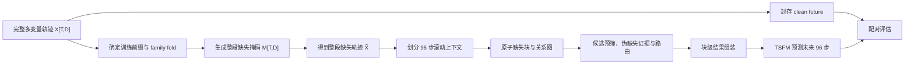

# TSFM-FAIS：面向下游 TSFM 预测的块级多算法缺失值填补

TSFM-FAIS 实现 B-FAIS（Block-wise Forecast-Aware Imputer Selection）。系统接收带缺失的多变量时间序列，将每个变量上的极大连续缺失区间表示为原子块，从可扩展候选池中为不同缺失块选择填补算法，再组装成完整上下文供下游时间序列基础模型（TSFM）预测。填补阶段始终使用全部变量；预测阶段既支持原生联合多变量模型，也支持将一个或多个目标变量分别交给单变量模型。

当前仓库正在实施 `sequence-mask-96x96-v2` 实验协议。旧实验产物和旧结果已经删除。真实 checkpoint pilot 已完成，主实验尚未运行；下文只报告 pilot 的链路验收结果，不声明 B-FAIS 优于任何基线。

## 问题定义

给定完整多变量轨迹 \(X\in\mathbb{R}^{T\times D}\)、观测掩码 \(M\in\{0,1\}^{T\times D}\)、目标预测器 \(f\) 和计算预算，B-FAIS 为缺失块集合 \(\mathcal B\) 求解候选分配 \(a_b\)：

```text
E(a) = Σ_b R(b, a_b)
     + β Σ_(b,c)∈Edges φ(b, c, a_b, a_c)
     + λ Σ_i 1[i 被启用] cost(i)
```

`R` 表示单块下游预测风险，`φ` 表示相关缺失块采用不同候选时的交互风险，最后一项约束启用候选的计算成本。路由目标由冻结 TSFM 在反事实填补上下文上的预测损失产生；填补重构误差、历史伪缺失证据、块结构和候选成本共同作为特征。

## 新版主实验协议

### 固定设置

| 项目 | 设置 |
|---|---|
| 协议 ID | `sequence-mask-96x96-v2` |
| 上下文长度 | 96 |
| 预测长度 | 96 |
| 主评估滚动步长 | 96 |
| 填补输入 | `[96,D]` 多变量窗口 |
| 预测目标 | 第 0、1 个变量，按目标宏平均 |
| 目标缺失率 | `{0.1,0.2,0.3,0.4,0.5}` |
| 教师种子 | `20260710` |
| 最终评估种子 | `{22,33,44}`，在实验格中均衡轮换 |
| 每数据版本教师 episode 上限 | 30，覆盖全部 `6×5` 机制—缺失率组合 |
| 每数据版本评估 episode 上限 | 30，覆盖全部 `6×5` 组合 |
| 每数据版本 item 上限 | 4，确定性选择 |
| 候选短名单 | 最多 6 个，强制保留 LOCF 和线性插值 |
| Beam width | 32 |
| TSFM 预测样本数 | 20 |

上下文长度和预测长度在填补器训练、教师标签、路由器训练和最终预测中统一为 96。工程 smoke 可以使用更短的合成序列以控制执行时间；它不产生论文实验结果。

### 整段序列先生成缺失，再划分滚动窗口

每个 `(dataset, item, mechanism, rate, seed)` 只生成一次完整轨迹掩码：

\[
M_s=G(X,m,r,s),\qquad
\widetilde X_s=M_s\odot X+(1-M_s)\odot\mathrm{NaN}.
\]

随后从同一个 \(\widetilde X_s\) 提取滚动预测 episode：

\[
C_{s,t}=\widetilde X_s[t-96:t],\qquad
Y_t=X[t:t+96,\{0,1\}].
\]

掩码种子只包含数据集、item、机制、缺失率和重复种子，不包含预测起点。不同滚动窗口在相同时间位置共享同一缺失状态。Clean future 只用于教师损失和最终评分，不进入填补器、路由特征或 TSFM 输入。



主实验不按窗口实际缺失数量筛选 episode。结果同时报告全部窗口和实际包含缺失的窗口，避免由难度筛选造成偏差。每个产物保存整段目标缺失率、整段实际缺失率、窗口局部缺失率和缺失实现 ID。

### 六种序列级缺失机制

| ID | 定义 |
|---|---|
| `random_point` | 在完整轨迹上产生随机点缺失 |
| `independent_block` | 各变量独立产生连续缺失块 |
| `synchronous_block` | 同一时间区间内全部变量同步缺失 |
| `staggered_correlated` | 根据训练前缀的相关变量组产生带偏移的相关块 |
| `value_dependent` | 使用训练前缀的中位数和 MAD 标准化，偏离中心的值具有更高缺失概率 |
| `mixed_outage` | 随机点与连续故障块构成的序列级混合缺失过程 |

连续块长度从 `{6,12,24,48}` 中确定性抽样。主实验不强制在每个预测起点前生成尾部缺失；预测前突发故障可作为独立压力测试，其结果不并入主表。

### 数据准入和外层划分

[`configs/data/datasets.yaml`](configs/data/datasets.yaml) 登记 32 个来源完整、无 NaN/Inf、至少包含两个变量的数据版本。数据仍保存在相邻 `TSFM-SPImpute/data/Origin` 目录，无需移动或复制。每次实验必须重新执行审计；旧审计文件不复用。

最终预测要求至少提供 96 步上下文和 96 步未来。现有 32 个版本中有 31 个满足长度要求，覆盖 18 个 family：

| 格式 | 进入 96→96 预测实验的数据版本 |
|---|---|
| CSV | `electricity`, `ETTh1`, `ETTh2`, `ETTm1`, `ETTm2`, `exchange_rate`, `national_illness`, `traffic` |
| Arrow | `azure2019_D_5T`, `azure2019_I_5T`, `azure2019_U_5T`, `Coastal_T_S_15T`, `Coastal_T_S_20T`, `Coastal_T_S_H`, `current_velocity_5T`, `current_velocity_15T`, `current_velocity_20T`, `current_velocity_H`, `EWELD_Load_15T`, `Job_Claims_W`, `JOLTS_M`, `NE_China_Wind_H`, `OpenElectricity_NEM_5T`, `Port_Activity_D`, `Port_Activity_W`, `Supply_Chain_Customer_D`, `Supply_Chain_Location_D`, `Uncertainty_1M_M`, `US_Labor_M`, `Vehicle_Sales_M`, `Vehicle_Supply_M` |

`Housing_Inventory_M` 只有 114 步，保留在数据审计和填补辅助测试中，不进入 96→96 预测结果。`Job_Claims_W` 只有少量可用预测起点，结果中单独报告其支持度。

外层评价使用 `leave_family_out`。ETT、Azure、Coastal、Current Velocity、Port Activity、Supply Chain 和 Vehicle 等同源或多频率版本始终留在同一侧。测试 family 的教师标签不会参与对应路由折训练。学习型填补器只允许使用当前 item 在预测起点之前的缺失历史做无监督拟合或标准化，不能读取预测未来。

## 候选填补池

默认注册 20 个标准候选，不包含任何 SPImpute 方法。当前 TRMF 适配器因 PyPOTS 1.5 生命周期与冻结 artifact 协议不兼容而禁用；正式运行前冻结可执行清单，运行中不增删候选。

| 类别 | 候选 ID |
|---|---|
| 逐变量经典方法 | `locf`, `linear_interp`, `seasonal_lag`, `kalman_local_trend`, `kalman_ar`, `stl_kalman`, `gp_rbf` |
| 联合结构化方法 | `knn_multivariate`, `mice`, `missforest`, `softimpute` |
| 深度/时序方法 | `trmf`, `brits`, `gpvae`, `saits`, `csdi`, `imputeformer`, `helix`, `timemixerpp`, `totem` |

所有候选实现统一的训练与推理契约：

```python
fit(train_batch, metadata) -> artifact
impute(batch, artifact, seed) -> CandidateResult
```

逐变量方法遍历全部 `D` 个变量后重新组装 `[N,L,D]`；联合方法直接处理完整多变量张量。公共 runner 恢复原观测值并显式记录原生有效掩码、失败原因、耗时和内存。新增算法只需实现适配器并注册 `ImputerSpec`，路由代码不依赖具体候选类。

## 块级路由

每个变量上的极大连续缺失区间构成一个 `MissingBlock`。块关系图包含同变量相邻边、跨变量时间重叠边和训练期高相关变量边。特征覆盖块长度、相对位置、边界可用性、局部与整段缺失率、周期、相关性、候选能力、候选成本、TSFM 能力和伪缺失重构证据。

`R0` 和 `R1` 使用 LightGBM LambdaMART，候选是行、同一块的候选构成 ranking group；块对交互使用 LightGBM Huber 回归。预筛强制保留 `locf`、`linear_interp`，再按预测风险覆盖和成本加入候选，总数不超过 6。最终分配采用确定性 beam search；小规模穷举只用于正确性测试。

新版为五个 TSFM 分别生成教师标签，并在每个 family fold 内训练带 TSFM 模型 one-hot 特征的条件路由器。推理时每个 TSFM 独立执行路由；Chronos-Bolt、Sundial 和 TiREx 不复用 TimesFM 2.5 的块分配。

## TSFM 预测模式

| ID | 模式 | 输入与输出 |
|---|---|---|
| `chronos2` | `joint_multivariate` | 输入 `[N,96,D]`，输出目标预测 `[N,96,K]` |
| `timesfm2p5` | `independent_univariate` | 展开目标列为 `[N×K,96]` 后重组 |
| `chronosbolt` | `independent_univariate` | 同上 |
| `sundial` | `independent_univariate` | 同上 |
| `tirex` | `independent_univariate` | 同上 |

所有 TSFM 使用本地冻结 checkpoint，不进行微调。统一结果包含点预测 `[N,H,K]`、分位数 `[N,H,K,Q]` 和样本 `[N,S,H,K]`。独立单变量预测器只读取目标列；目标列在此前已通过全部变量联合填补。

## 评价与统计

主要指标为目标列宏平均 MASE。缩放项从训练前缀计算并冻结到 schema 3 填补产物；历史足够时采用 manifest 的季节周期，其余情况使用 lag-1。主要比较为 B-FAIS 相对 LOCF、线性插值及各个可执行固定候选的同 episode 配对差。Clean context 和单候选 oracle 只用于诊断。

汇总以 family 等权为主要结果，并按数据版本、频率、TSFM、预测模式、缺失机制和缺失率分组。`family_macro_comparison_summary.csv` 同时给出全部窗口和实际含缺失窗口两种视图；区间估计依次重采样 `family → dataset → item/mask realization`，family 级 Wilcoxon 检验在同一分层内使用 Holm 校正。跨数据族的原始 MAE/RMSE 不直接合并解释；填补 MAE/RMSE、有效率、运行时间、内存和 oracle regret 作为辅助指标。

## 配置与阶段

```text
configs/main.yaml       # 教师标签与路由训练，96×96
configs/main_eval.yaml  # 独立最终掩码与预测评估，96×96
configs/pilot.yaml      # 真实数据和 checkpoint 的小规模预检，96×96
configs/smoke.yaml      # 离线快速工程验证
```

阶段入口保持为：

```powershell
python -m tsfm_fais config validate --config configs/main.yaml
python -m tsfm_fais data audit --manifest configs/data/datasets.yaml --output artifacts/data-audit-seq96-v2.json
python -m tsfm_fais run --config configs/main.yaml --stage fit-imputers --run-id seq96-fit-v2 --audit-artifact artifacts/data-audit-seq96-v2.json --execute
python -m tsfm_fais run --config configs/main.yaml --stage labels --run-id seq96-labels-<model>-v2 --audit-artifact artifacts/data-audit-seq96-v2.json --imputer-artifacts artifacts/seq96-fit-v2/imputer_artifacts --forecaster-id <model> --forecaster-artifact checkpoints/forecasters.json --execute
python -m tsfm_fais labels merge --inputs <five-label-directories> --output-dir artifacts/seq96-labels-merged-v2
python -m tsfm_fais run --config configs/main.yaml --stage train-router --run-id seq96-router-v2 --labels-artifact artifacts/seq96-labels-merged-v2/teacher_labels.jsonl --execute
python -m tsfm_fais run --config configs/main_eval.yaml --stage impute --run-id seq96-impute-<model>-v2 --audit-artifact artifacts/data-audit-seq96-v2.json --imputer-artifacts artifacts/seq96-fit-v2/imputer_artifacts --router-artifact artifacts/seq96-router-v2/router_folds --forecaster-id <model> --execute
python -m tsfm_fais evaluate --config configs/main_eval.yaml --impute-artifact artifacts/seq96-impute-<model>-v2 --forecaster-id <model> --forecaster-artifact checkpoints/forecasters.json --output-dir artifacts/seq96-eval-<model>-v2
python -m tsfm_fais summarize-main --input artifacts/seq96-eval-chronos2-v2 artifacts/seq96-eval-timesfm2p5-v2 artifacts/seq96-eval-chronosbolt-v2 artifacts/seq96-eval-sundial-v2 artifacts/seq96-eval-tirex-v2 --output-dir artifacts/seq96-summary-v2
```

`artifacts/` 不纳入版本控制。新版运行必须使用全新的 run ID；旧协议产物和结果不得复用。

## 安装与验证

项目要求 Python `>=3.10,<3.12`。核心依赖由 `pyproject.toml` 声明，PyTorch、PyPOTS 和各 TSFM 通过独立 extra 安装。

```powershell
python -m compileall src tests
python -m pytest -q -m "not slow and not gpu and not network"
python -m tsfm_fais smoke --config configs/smoke.yaml
```

新版新增的关键测试包括：整段掩码种子不含预测起点、重叠窗口共享掩码、改变未来值不会改变过去的值无关缺失过程、0.4 缺失率、96×96 episode、短数据准入、测试 family 标签隔离、模型专属路由以及新旧 artifact 不兼容检查。

## 当前状态

- 旧实验结果和旧 `artifacts/` 已删除。
- 新实验规划已写入本 README。
- 整段序列缺失、96→96 episode、模型条件路由、冻结 MASE 缩放项和 family-macro 汇总已经实现。
- 32 个登记数据版本已只读审计通过；其中 31 个可进入 96→96 预测。
- 非慢速测试共 232 项通过，合成 smoke 输出 `SMOKE PASS`。
- 2026-07-15 完成真实 checkpoint pilot：ETTh1、`synchronous_block`、目标缺失率 `{0.2,0.4}`、上下文 96、预测 96、Chronos-2 与 TimesFM 2.5。19 个候选成功拟合或为无状态方法，TRMF 按兼容性约束禁用；标签、合并、路由训练、填补、预测和汇总阶段均完成。
- pilot 共包含 2 个缺失 episode 和 2 个 TSFM，即 4 个配对评估单元。总体 MASE 为 B-FAIS `1.7248`、LOCF `1.8147`、线性插值 `1.7248`、clean context `1.3928`、单候选 oracle `1.4257`。
- pilot 路由器在全部缺失块上选择了 `linear_interp`，因此 B-FAIS 与线性插值的填补和预测指标完全相同。该结果只验证真实模型执行链路和产物协议；仅有 8 个 ranking groups，不能用于评价多算法路由收益或统计显著性。完整诊断见 `artifacts/pilot-seq96-summary-v2/report.md`。
- 五模型、31 个数据版本、六种缺失机制和五档缺失率的主实验尚未运行。

## 可核验来源

- [Autoformer 官方实现](https://github.com/thuml/Autoformer)：`seq_len=96`、`pred_len=96` 的长序列预测配置。
- [PyPOTS 文档](https://docs.pypots.com/)
- [scikit-learn 缺失值填补](https://scikit-learn.org/stable/modules/impute.html)
- [LightGBM Python API](https://lightgbm.readthedocs.io/en/latest/Python-API.html)
- [Amazon Chronos](https://github.com/amazon-science/chronos-forecasting)
- [Google TimesFM](https://github.com/google-research/timesfm)
- [Sundial 论文](https://arxiv.org/abs/2502.00816)
- [NX-AI TiRex](https://github.com/NX-AI/tirex)
- [ETDataset](https://github.com/zhouhaoyi/ETDataset)
- [Monash Forecasting Repository](https://forecastingdata.org/)
