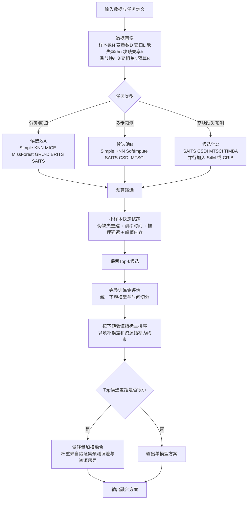

# 多变量时间序列缺失值填补算法选择与下游预测评测研究报告

## 执行摘要

这类研究的核心结论已经越来越明确：对多变量时间序列而言，“填补误差最低”的方法，并不必然带来“下游预测最优”的结果。较早的 BRITS 已经把填补与分类/回归联合起来，并报告了同时提升填补与下游任务表现；SAITS 进一步强调了在保持较高填补精度的同时提升训练效率，并指出更好的填补可以改善后续模式识别模型；GAN 系列中的 STING、概率生成式分类框架，以及近期面向缺失预测的端到端模型，也都把评价重点转向了分类、回归或预测效果本身。到 2025 年，针对预测场景的研究甚至直接指出，在没有缺失真值监督时，“先填补再预测”会扭曲数据分布并主动伤害预测精度；S4M 和 CRIB 这类缺失感知预测模型因此成为必须纳入的对照，而不是可有可无的扩展。citeturn25view1turn25view2turn32view0turn32view2turn32view3turn34view0turn34view2

如果你的目标是在效率与预测性能之间取得平衡，最稳妥的研究路线不是直接押注某一类深度模型，而是建立一个“三层候选池”。第一层是极低成本基线，如均值/中位数、前向填充、线性插值、KNN；第二层是经典但常常仍然很强的结构化方法，如 SoftImpute/低秩矩阵分解、MICE、MissForest、Kalman/EM；第三层是现代时序模型，如 GRU-D、BRITS、SAITS、CSDI/MTSCI/TIMBA，再外加“无显式填补”的缺失感知预测基线。这样做的原因有二：一是简单填补配合强预测器有时并不弱，scikit-learn 的官方文档甚至明确指出，简单填补在强学习器下可能达到与复杂填补相当甚至更好的预测效果；二是近期综述和工具库已经形成了较成熟的统一实验生态，特别是 PyPOTS，适合作为复现实验与统一基准的工程底座。citeturn29view3turn35view1turn24view3turn24view4turn23view0

在没有指定下游任务和数据集时，我建议默认覆盖四类常见场景：单步回归、单步分类、多步预测、以及高缺失率下的缺失感知预测。指标上应采用“双目标甚至三目标”框架：下游预测指标是主目标，填补质量指标是辅助目标，训练/推理延迟与峰值内存是部署约束。对回归和预测任务，RMSE 与 MAE 应作为主报告指标，同时补充 sMAPE 或 MASE；MAPE 在接近零值时容易失真，不能单独使用。对分类任务，AUROC、AUPRC、F1-macro 与 Balanced Accuracy 应优先于单纯 Accuracy。对概率填补或多重填补，则应增加 CRPS、NLL 或覆盖率一类不确定性指标。citeturn25view4turn17academia0turn17search4turn25view3turn37view0

综合现有文献，我对默认主线的建议是：以 SAITS 作为“效率—效果平衡型主力”，以 MissForest 和 MICE 作为中小规模结构化对照，以 KNN 和线性插值作为极简强基线，以 CSDI 或 MTSCI 代表高质量生成式填补，以 GRU-D/BRITS 代表把缺失模式作为信号利用的序列模型，并将 S4M 或 CRIB 作为“不经过显式填补”的上界或挑战者。若研究最终目标是预测而不是还原缺失真值，这个设置比单纯比较填补误差更符合问题本质。citeturn24view2turn9academia2turn29view0turn29view2turn25view3turn13academia2turn26academia0turn25view1turn34view2turn34view0

## 目标与问题定义

你的研究问题可以形式化为：给定带缺失的多变量时间序列 \(X \in \mathbb{R}^{T \times D}\) 及缺失掩码 \(M\)，选择一个填补器 \(I\) 产生 \(\hat X\)，再由下游模型 \(f\) 完成预测任务 \(y=f(\hat X)\)；目标不是最小化单纯的 \(\|\hat X-X\|\)，而是在给定计算预算下最小化下游风险 \(L_{\text{task}}(f(\hat X), y)\)，并同时约束训练时间、推理时延和内存。近期综述也把这一点写得很清楚：填补模型的目标既可以是逼近完整数据，也可以是提升下游任务表现；这两者在实践中并不总一致。citeturn35view0

当下游任务未预先指定时，通常应覆盖四个常见场景。单步回归适用于质量预测、设备健康指标预测、下一时刻负载或污染物浓度估计；多步预测适用于能源调度、空气质量预警、交通流量规划；样本级分类适用于 ICU 死亡风险、故障类别、行为识别；序列级或事件级分类适用于发病预警、告警检测和状态切换识别。PhysioNet 2012 本身就是基于前 48 小时 ICU 多变量记录预测住院死亡，PEMS-SF 则对应多变量交通时序分类，Beijing PM2.5 与 UCI Air Quality 则天然适合回归和单步或多步预测。citeturn28view0turn28view2turn22view1turn18view0turn18view1

若你需要一条实用的选择规则，可以按“业务输出”而不是按“算法流派”来定任务定义：如果你最终要预测一个连续值且仅关心最近将来，用单步回归；如果要预测未来多个时间步或形成滚动决策，用多步预测；如果标签是风险、事件、类别或状态，用分类；如果你怀疑缺失模式本身携带信息，尤其是在医疗与工业场景，还应把缺失感知预测模型单独作为一类基线，因为 GRU-D、BRITS、以及近期的 S4M/CRIB 都表明，缺失模式不只是噪声，也可能是有用信号。citeturn26academia0turn25view1turn34view2turn34view0

下面这张表给出一个面向研究设计的默认任务与指标框架。

| 常见场景 | 典型数据 | 主输出 | 主指标 | 辅助指标 | 备注 | 主要来源 |
|---|---|---|---|---|---|---|
| 单步回归 | 空气质量、设备传感器、能源负载 | 下一时刻或下一窗口连续值 | RMSE、MAE | sMAPE/MASE、R² | MAPE 不能单独使用，接近零时会失真 | citeturn17academia0turn17search4turn18view0turn18view1 |
| 多步预测 | Electricity、Traffic、Weather、ETT 类任务 | 未来 \(H\) 步序列 | RMSE、MAE | sMAPE、CRPS | 需要滚动或直接多步评估 | citeturn19view0turn19view1turn25view3turn34view2 |
| 样本级分类 | ICU 死亡风险、活动识别 | 二分类或多分类 | AUROC、AUPRC、F1-macro | Balanced Accuracy、ECE | 极度不平衡时应重视 AUPRC | citeturn28view2turn26academia0turn32view2 |
| 序列级分类 | PEMS-SF、传感器分类 | 类别标签 | Accuracy、F1-macro | Recall、Precision | 高维多变量下需关注缺失位置一致性 | citeturn22view1turn32view3 |
| 填补质量评估 | 任意伪缺失设置 | 被遮蔽观测点重建 | MAE、RMSE | MAPE、DTW | 仅作为辅助，不应替代下游指标 | citeturn25view4turn35view0 |
| 资源与部署评估 | 任意 | 训练与推理开销 | 训练时间、推理 p50/p95 延迟 | 峰值内存、吞吐 | 这是算法选择研究的必要维度 | citeturn24view2turn29view3turn39academia1 |

缺失机制的设置至少应同时覆盖 MCAR、MAR、MNAR 三类。近期综述沿用 Rubin 的经典划分：MCAR 表示缺失独立于观测与未观测值，MAR 表示缺失依赖观测值，MNAR 则与未观测值本身相关。对于时间序列，还应显式区分“点缺失”“连续块缺失”“整变量通道缺失”“靠近预测起点的尾部缺失”几种模式，因为它们会对应完全不同的难度与算法偏好。S4M 与 CRIB 的结果尤其说明，连续块缺失和高缺失率下，传统两阶段方法更容易出现误差累积。citeturn35view0turn34view2turn34view0

## 近五年文献综述与方法比较

近五年的主线可以概括为两个方向同时推进。第一个方向是在填补器内部增强时序、变量间关系和不确定性建模能力，代表方法包括 SAITS、CSDI、MTSCI、TIMBA、NuwaTS 等；第二个方向是重新质疑“填补优先”的默认流程，把目标切回预测本身，代表方法包括 S4M、CRIB 与若干面向分类的联合优化模型。2024 年综述已经把深度时序填补方法系统整理为预测型与生成型两大类，并进一步按 RNN、CNN、GNN、Attention、VAE、GAN、Diffusion 等架构划分，同时明确指出评估不应只看填补误差，还应检查对分类等下游任务的改进。citeturn35view0turn35view1

从工程视角看，现有方法并不适合简单按“传统”与“深度”二分。真正影响研究成败的是五个维度：是否显式利用缺失掩码与时间间隔，是否能建模变量间相关性，是否能表达不确定性，是否能扩展到长序列和高维度，是否有成熟实现。PyPOTS 已经把大量缺失时间序列模型统一到同一接口中，并同时覆盖填补、分类和预测任务，这使它很适合作为你的实验底座。对中文材料有需求时，PyPOTS 仓库还提供简体中文 README，可作为工程入口。citeturn24view3turn24view4turn41view0

下表总结了建议重点纳入的候选方法。复杂度列是依据原论文/官方文档所描述的算法结构给出的工程量级估计，目的是帮助做预算筛选，而不是替代严格理论分析。citeturn29view0turn29view2turn24view2turn25view3turn33view2

| 方法家族 | 代表方法 | 已知下游表现 | 主要优点 | 主要局限 | 典型时间/空间复杂度估计 | 可扩展性与实现难度 | 官方实现或主要来源 |
|---|---|---|---|---|---|---|---|
| 统计插值 | 均值/中位数、LOCF、线性插值 | 简单填补在强学习器下有时不弱；但弱学习器下通常较差 | 极快、稳定、易复现 | 忽略跨变量与复杂动态 | 约 \(O(TD)\) 时间，\(O(TD)\) 空间 | 极强，可直接作为第一层基线 | scikit-learn SimpleImputer citeturn29view3 |
| 邻近搜索 | KNNImputer | 中低维数据常是强基线；对局部相似结构有效 | 无需训练大模型，解释性较强 | 大样本下距离计算昂贵；长序列前需重整形/特征化 | 常见实现约 \(O(N^2D)\) 量级 | 中等，可并行近邻检索 | scikit-learn KNNImputer citeturn29view2 |
| 低秩分解 | SoftImpute、矩阵分解 | 在较强低秩结构和规则采样时常有效；对预测任务可作为稳定中档对照 | 对高相关多变量较友好，参数较少 | 难处理强非线性与复杂 MNAR | 每轮约 \(O(r \cdot \text{nnz})\) 到 \(O(TDr)\) | 中等，实现相对成熟 | softImpute/矩阵完成论文 citeturn31academia0 |
| 链式多重填补 | MICE、IterativeImputer | 在中小规模表格化时序特征上依然常见；近期 Bayes-MICE 也显示其可扩展到时序并量化不确定性 | 灵活、可与任意回归器组合、可做多重填补 | 高维和高块缺失时慢，变量强相关时不稳定 | 约 \(O(p \times \text{base-model-cost} \times \text{iter})\) | 中等偏难，适合中小数据 | IterativeImputer；Bayes-MICE；bigMICE citeturn29view0turn39academia2turn39academia1 |
| 树模型填补 | MissForest | 多项非深度研究中表现稳健，常优于 KNN/MICE 于混合非线性关系 | 非线性强、无需分布假设 | 训练耗时和内存较大，长序列需先做窗口化 | 约 \(O(p \times n_{\text{trees}} \times N \log N)\) 每轮 | 中等，适合 CPU 并行 | missForest 原始论文；近期比较研究 citeturn9academia2turn9academia1 |
| 状态空间 | EM/Kalman smoother | 在规则线性动力下很强；2023 蒙特卡洛研究中 Kalman 处理缺失表现突出 | 对线性高斯过程高效，适合在线更新 | 对强非线性、高维交互不够灵活 | 常见状态空间平滑约 \(O(TD^3)\) | 中等，在线场景友好 | EM 时序论文；Kalman 比较研究 citeturn12academia2turn40academia0 |
| 缺失感知 RNN | GRU-D | 直接利用掩码和时间间隔，在医疗分类中长期有效 | 自然处理 informative missingness | 主要面向分类；长序列训练仍受 RNN 限制 | 约 \(O(TH^2)\) 或 \(O(TDH)\) | 中等，复现较容易 | GRU-D 原始论文 citeturn26academia0 |
| 双向 RNN 联合填补 | BRITS | 原论文明确报告同时提升填补与分类/回归 | 将缺失值作为图中变量参与反传，下游导向更明确 | RNN 训练较慢，长序列扩展性一般 | 约 \(O(TH^2)\)；双向常数更大 | 中等，现成代码较成熟 | BRITS 论文与官方仓库 citeturn25view1turn25view0 |
| Attention 填补 | SAITS | 对比 BRITS，报告 12%–38% MAE 改进与 2.0–2.6 倍训练加速，并能改善后续模式识别 | 准确率与效率均衡，工程上很适合做默认主力 | 长窗口注意力成本随 \(L^2\) 增长 | 常见实现约 \(O(L^2d)\) 时间，\(O(L^2)\) 注意力内存 | 强，推荐作为平衡型主方法 | SAITS 论文与官方仓库 citeturn25view2turn24view2 |
| GAN 填补 | STING、Bi-GAN | STING 明确报告在下游任务上也优于对照；Bi-GAN 同时做填补与预测 | 能学习复杂分布，可面向联合目标 | 对抗训练不稳定，调参成本高 | 依网络结构而定，通常高于同规模判别式模型 | 中等偏难 | STING；Bi-GAN citeturn32view0turn32view1 |
| 扩散生成式 | CSDI、MTSCI、TIMBA | CSDI 可用于概率预测；MTSCI 与 TIMBA 强调一致性和下游分析，通常在高缺失率下有优势 | 能表达不确定性，对复杂缺失模式更强 | 训练和采样成本高，推理延迟高 | 常见为“主干复杂度 × 扩散步数 \(K\)” | 中等偏难到难，适合离线高质量测试 | CSDI、MTSCI、TIMBA 官方论文/仓库 citeturn25view3turn25view4turn33view2turn23view3turn23view4 |
| 大规模预训练 | NuwaTS | 强调跨变量、跨领域泛化，并可迁移到预测任务 | 零样本/少样本迁移潜力，跨域强 | 工程复杂，训练与适配成本高 | 取决于 PLM 主干，通常较高 | 难，适合扩展研究 | NuwaTS 论文 citeturn36view1turn36view2 |

从“下游预测优先”的角度解读这张表，可以得出三条较稳的经验结论。其一，简单方法不能省。因为在强学习器和较低缺失率场景下，简单填补配合缺失指示变量可能已经接近更复杂方法，而这对“效率—效果”权衡非常重要。其二，SAITS 目前仍是非常强的默认平衡点：它既吸收了注意力模型对时序与变量依赖的建模能力，又比许多 RNN 与生成式方法更易训练、更易调参。其三，对高块缺失和高缺失率预测任务，不应只比较填补器之间的胜负，还要把 S4M、CRIB 这类不依赖显式填补的模型加进来，否则实验结论很可能高估两阶段流程。citeturn29view3turn24view2turn34view2turn34view0

## 实验设计建议

在数据集选择上，建议同时覆盖“天然带缺失”和“原始较完整、便于人工注入缺失”的两类数据。前者让研究结果更贴近真实应用，后者便于构造可控真值评估。下面这组公开数据集能够同时覆盖回归、预测和分类三类常见下游任务。citeturn18view0turn18view1turn28view0turn28view3turn19view0turn19view1turn22view1

| 数据集 | 任务建议 | 原生缺失情况 | 缺失模式可控性 | 适合作为 | 主要来源 |
|---|---|---|---|---|---|
| Beijing PM2.5 | 单步/多步回归 | 原生存在 NA，2010–2014 小时级 | 可在观测点上再注入点缺失与块缺失 | 环境预测、天然缺失评估 | citeturn18view0 |
| UCI Air Quality | 单步/多步回归 | 缺失用 -200 标记，小时级多变量传感器 | 可对非缺失片段再做人为遮蔽 | 传感器漂移与环境预测 | citeturn18view1 |
| PhysioNet 2012 | 二分类、也可做回归/早预警 | 原生高度稀疏，12,000 ICU stays，前 48 小时 42 变量 | 可在已有观测上做伪缺失，也可保留原生稀疏 | 医疗分类、informative missingness | citeturn28view0turn28view1 |
| MIMIC-IV | 二分类、回归、序列预测 | 大规模真实 EHR，94,458 ICU stays | 可提取相对完整子集，再注入结构化缺失 | 大规模医疗外部验证 | citeturn28view3 |
| Monash Electricity | 多步预测 | 原始版本无天然缺失，321 变量小时级 | 非常适合系统注入缺失 | 规则长序列预测 | citeturn19view0 |
| Monash San Francisco Traffic | 多步预测 | 原始版本无天然缺失，862 变量小时级 | 适合研究块缺失与通道缺失 | 高维交通预测 | citeturn19view1 |
| PEMS-SF | 多变量分类 | 原始整理版本较完整 | 适合人工注入传感器缺失与时间块缺失 | 交通时序分类 | citeturn22view1 |

缺失机制建议至少设置四组：随机点缺失、连续块缺失、通道缺失、混合缺失。比例建议统一做 10%、20%、30%、50% 四档，其中块缺失再加一个长度控制，例如以输入窗口长度的 5%、10%、20%、40% 作为块长。对于预测任务，还应额外设置“靠近预测起点的尾部缺失”，因为这类缺失对实际多步预测最致命，而 S4M 等近期方法恰恰强调了这类场景的重要性。MNAR 设置可通过让缺失概率依赖当前值大小、变化率、或标签相关特征来构造；医疗数据中则可额外保留原生缺失模式，作为真实 setting。citeturn35view0turn34view2turn37view0

下游模型建议至少覆盖三档：线性模型、树模型、深度序列模型。线性模型可用 Ridge/ElasticNet 或简单线性回归；树模型可用 XGBoost、LightGBM 或随机森林；深度模型可用 GRU/LSTM、TCN、PatchTST/iTransformer 一类。这样做的意义在于，把“填补器是否依赖下游模型强度”显式测出来。因为简单填补在强树模型下有时相当有竞争力，而深度填补模型对线性预测器的增益又常常更明显。citeturn29view3turn24view2turn21academia2turn24view3

你要求的“候选填补算法 × 下游模型组合矩阵”可以按下表执行。这里的“优先”表示我建议首先纳入主实验，“可选”表示适合扩展实验，“谨慎”表示价值主要在研究完整性而非默认主线。这是基于上述文献与工程约束综合形成的建议矩阵。citeturn29view3turn24view2turn25view3turn34view2turn34view0

| 填补算法 \ 下游模型 | 线性模型 | 树模型 | GRU/LSTM | Transformer/SSM |
|---|---|---|---|---|
| 均值/LOCF/线性插值 | 可选 | 优先 | 谨慎 | 谨慎 |
| KNN | 可选 | 优先 | 可选 | 谨慎 |
| SoftImpute/矩阵分解 | 可选 | 可选 | 可选 | 可选 |
| MICE | 可选 | 优先 | 谨慎 | 谨慎 |
| MissForest | 可选 | 优先 | 可选 | 谨慎 |
| Kalman/EM | 优先 | 可选 | 可选 | 谨慎 |
| GRU-D | 不适用 | 不适用 | 优先 | 可选 |
| BRITS | 谨慎 | 可选 | 优先 | 可选 |
| SAITS | 可选 | 可选 | 优先 | 优先 |
| CSDI/MTSCI/TIMBA | 谨慎 | 谨慎 | 可选 | 优先 |
| 无显式填补的 S4M/CRIB | 不适用 | 不适用 | 可选 | 优先 |

评估流程上，建议严格分成两个层次。第一层是“伪缺失重建评估”：只在原本可观测的位置再随机遮蔽，计算 MAE/RMSE 等填补指标。第二层是“真实下游评估”：使用完整训练窗口或训练部分的观测值训练填补器，在验证集和测试集上仅根据已有信息产出填补结果，再训练或调用下游预测器，最终以预测精度为主报告。对多步预测，采用 rolling-origin evaluation；对分类，采用按病人/样本分层拆分，绝不能按时间点随机拆分。每组“缺失比例 × 缺失机制 × 数据集 × 下游模型”至少重复 5 个随机种子；对伪缺失遮蔽也要独立重复 5 次，以降低偶然性。citeturn28view2turn35view0turn25view3

超参数策略上，填补器不宜做无限制大搜索，否则计算预算会被深度生成式方法吞噬。较好的折中是用分层调参。先在一个代表性数据子集上做粗搜索，随后固定一套稳健参数迁移到同类型数据集；或使用 PyPOTS 提供的统一接口做小规模 Optuna 搜索。深度模型应统一早停、统一最大训练轮次；生成式模型要额外控制采样步数，把“采样步数—质量曲线”作为效率分析的一部分，而不是默认用论文最大步数。citeturn24view3turn23view0turn25view3

## 算法选择与自适应设计

如果目标是形成一套能落地的算法选择方案，而不是只做静态排行榜，我建议把候选清单固定为十种：均值/线性插值、KNN、SoftImpute、MICE、MissForest、Kalman/EM、GRU-D、BRITS、SAITS、CSDI 或 MTSCI。若研究资源允许，再加 TIMBA；若研究目标最终是预测而非填补，再额外加入 S4M 与 CRIB 作为“无显式填补”参照。这个清单覆盖了从极简、传统统计、树模型、RNN、Attention，到 Diffusion 的完整谱系，足以用于做“预算—性能”边界分析。citeturn29view3turn29view2turn31academia0turn29view0turn9academia2turn40academia0turn26academia0turn25view1turn24view2turn25view3turn25view4turn33view2turn34view2turn34view0

在自适应选择上，最值得采用的是“先预算筛选，再小样本试跑，再按下游验证集重排”的三阶段策略。第一阶段只看数据特征与预算，直接剔除不可能合适的算法，例如在超长窗口且严格低延迟场景中不考虑扩散模型；第二阶段在训练集的 10% 到 20% 子集上做快速试跑，用伪缺失重建误差、训练时间、推理时间和峰值内存形成初筛；第三阶段对保留下来的少量候选，在完整训练集上按下游验证指标重排。预测指标必须权重大于填补误差，否则研究目标会偏离。对于排名非常接近的前两到三个候选，可以做轻量加权融合，特别是在它们的误差相关性不高时，组合通常更稳健。citeturn35view0turn17academia3turn37view0

下面给出一个推荐的选择/融合流程。流程图中把“无显式填补预测器”放在与填补器并列的位置，这一点很关键，因为近期研究已经表明，在高块缺失或高缺失率预测任务中，它们可能比任何两阶段方法都更稳。citeturn34view2turn34view0



下面这段伪代码给出一个便于实现的评分函数。它不是为追求理论最优，而是为保证实验可执行、可复现、可解释。citeturn24view3turn35view0turn34view2

```text
Input:
  data_profile = {N, D, L, missing_rate, blockiness, seasonality, cross_corr}
  task in {regression, classification, forecasting}
  budget = {train_time_limit, infer_latency_limit, memory_limit}
  candidate_pool

Stage 1: Hard filter
  remove algorithms that violate budget by design
  if task == forecasting and blockiness is high:
      add missing-aware predictors {S4M, CRIB} as parallel baselines
  if N small and D moderate:
      prioritize {MICE, MissForest, SAITS}
  if N large or L long:
      prioritize {Simple, KNN small, SoftImpute, SAITS}
  if uncertainty required:
      prioritize {CSDI, MTSCI}

Stage 2: Pilot ranking on subset
  for alg in filtered_pool:
      fit alg on subset_train
      evaluate on pseudo-missing subset_val
      train downstream model on imputed subset_train
      eval downstream on subset_val
      score(alg) =
          z(task_metric_rank) +
          lambda_q * z(imputation_metric_rank) +
          lambda_t * z(train_time_rank) +
          lambda_i * z(infer_latency_rank) +
          lambda_m * z(memory_rank)

Stage 3: Full evaluation
  keep top-k by score
  rerun on full train/val with repeated seeds
  choose best by mean downstream metric
  if top-2 gap < epsilon and error correlation low:
      ensemble with nonnegative weights summing to 1
Output best single model or ensemble
```

并行化方面，可以把整体任务分成四个粒度。数据级并行适合不同数据集与不同缺失模式；种子级并行适合重复实验；模型级并行适合候选算法并发试跑；时间块级并行则适合窗口化处理和批推理。MissForest、随机森林和近邻搜索天然适合 CPU 并行；SAITS、BRITS、CSDI、MTSCI、TIMBA、S4M、CRIB 主要受益于 GPU；SoftImpute 和部分 Kalman/EM 实现受益于高效线代后端。生成式方法的主要瓶颈通常不是训练而是采样，因此应把“ reduced sampling steps ”版模型单独列成一条效率曲线。citeturn39academia1turn24view2turn25view3turn33view2

## 实施与基准测试建议

工程优先级建议按“先结论、后扩展”的原则推进。首批必须落地的不是所有模型，而是能最快形成可信结论的最小基准：SimpleImputer/线性插值、KNN、MissForest 或 MICE、SAITS，再加一个无显式填补的预测基线。只要这五类先做通，你就已经能回答最关键的问题：简单方法是否足够、传统结构化方法是否仍有价值、SAITS 是否提供更优平衡、以及两阶段流程是否被缺失感知预测器压制。第二批再补 BRITS、GRU-D 和 SoftImpute；第三批再上 CSDI、MTSCI、TIMBA 这类高成本模型。citeturn29view3turn29view2turn9academia2turn29view0turn24view2turn34view2turn34view0

可复现性有四个最容易出问题的点。第一，数据泄漏：标准化、插值统计量、MICE 迭代器、树模型和深度填补器都必须只在训练集拟合，验证集和测试集只能调用 transform 或 inference。第二，时间切分：预测任务使用滚动或前推切分，不能随机打乱；医疗任务应按病人或住院记录拆分。第三，伪缺失构造：只能在原本已观测的位置再遮蔽，否则你得不到填补真值。第四，报销指标：必须同时报告均值、标准差、p50/p95 时延和峰值内存，否则“效率—性能平衡”没有证据基础。PyPOTS 的统一接口与超参支持很适合做这类标准化实验。citeturn24view3turn28view2turn35view0

评估表格建议至少包含三张。第一张是填补质量表，按数据集、缺失机制、比例报告 MAE/RMSE。第二张是下游任务表，按“填补器 × 预测器”报告主指标。第三张是资源表，报告训练时间、推理延迟、峰值内存和参数量。下面给出一个可直接使用的模板。citeturn25view4turn24view2turn25view3

| Dataset | Missing setting | Imputer | Predictor | Imputation MAE | Imputation RMSE | Task metric 1 | Task metric 2 | Train time | Infer p95 | Peak memory |
|---|---|---|---|---:|---:|---:|---:|---:|---:|---:|
| Beijing PM2.5 | MCAR-20% | SAITS | LightGBM |  |  |  |  |  |  |  |
| Electricity | Block-30%-len24 | KNN | PatchTST |  |  |  |  |  |  |  |
| PhysioNet2012 | Native + pseudo-mask | BRITS | Logistic / GRU |  |  |  |  |  |  |  |
| Traffic | Tail-missing-40% | CSDI | iTransformer |  |  |  |  |  |  |  |
| Traffic | Tail-missing-40% | None | S4M / CRIB | — | — |  |  |  |  |  |

对预期结果，我建议提前形成如下判断，以便解释实验现象。低缺失率、低块缺失、强树模型场景中，简单填补与 KNN 可能已经非常接近最优；在中等缺失率且窗口不太长的情况下，SAITS 往往会成为最稳妥的“默认赢家”；高缺失率、块缺失严重且允许离线推理时，CSDI、MTSCI、TIMBA 更可能在填补质量上占优，但其下游收益未必抵消延迟代价；对医疗分类与任何 informative missingness 明显的场景，GRU-D 和 BRITS 一类利用掩码/时间间隔的模型往往比忽略缺失模式的纯前处理更稳；而对多步预测尤其是靠近预测起点的尾部缺失，S4M 或 CRIB 可能直接超过所有两阶段方案。citeturn29view3turn24view2turn25view3turn25view4turn26academia0turn25view1turn34view2turn34view0

最后需要明确失败模式。第一，若不同填补器在伪缺失重建上有明显差异，但下游指标几乎不变，说明你的预测器可能已经足够强，填补不是瓶颈。第二，若填补误差更低但预测更差，往往说明填补器过度平滑，破坏了对预测有用的波动与分布形状；这正是近期预测文献对两阶段流程提出质疑的原因。第三，若生成式方法波动很大，通常不是“方法不行”，而是采样步数、训练轮次和随机种子不够受控。第四，若树模型填补在长序列高维数据上内存爆炸，则应改为滑窗特征化、分通道拟合或改用 SAITS/SoftImpute 一类更易批处理的方法。第五，若分类任务上所有两阶段方法都劣于联合模型，则你的研究结论应转向“下游导向训练优于独立填补”，而不应勉强从填补误差中解释。citeturn32view3turn34view0turn34view2turn37view0

整体上，如果你希望这项研究既有学术说服力，又能形成实用的算法选择建议，一个合理的主结论目标可以写成这样：在多变量时间序列缺失问题上，算法选择应由“数据特征 + 缺失模式 + 预算 + 下游任务”共同决定；默认研究主线应以 SAITS 为平衡型核心，配合 KNN/MissForest/MICE/SoftImpute 等中低成本对照，再以 CSDI/MTSCI/TIMBA 测试高质量上界，并始终把 S4M 或 CRIB 作为“无需显式填补”的挑战者。这样得到的结果，才真正回答“应选哪种填补算法”而不是“哪种方法在伪缺失重建上更像原值”。citeturn24view2turn9academia2turn29view0turn31academia0turn25view3turn25view4turn33view2turn34view2turn34view0